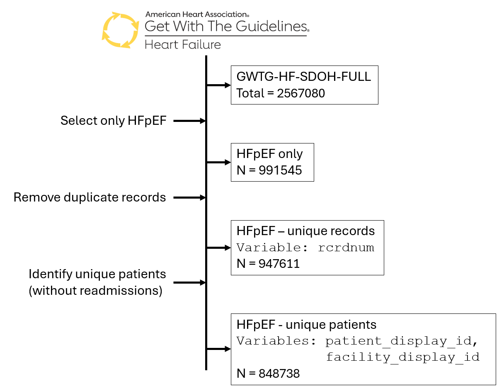
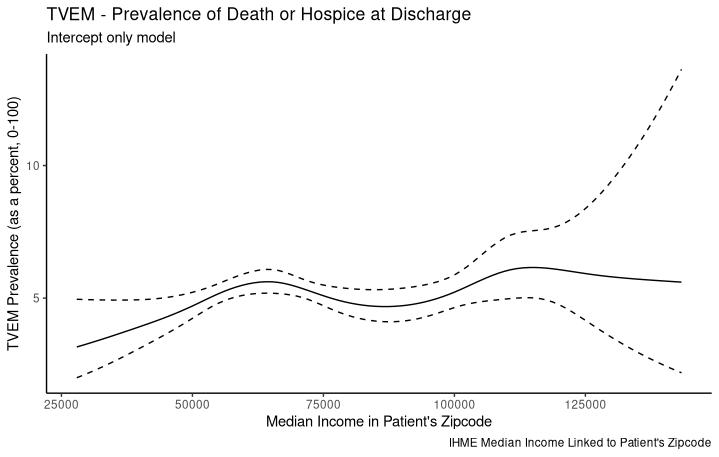
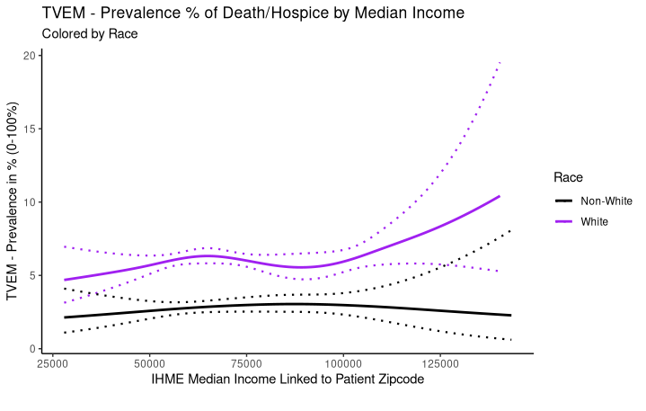
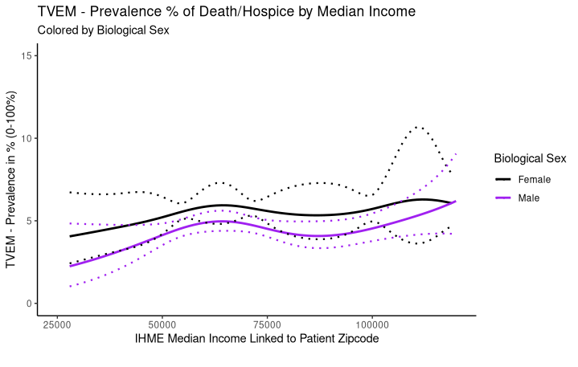
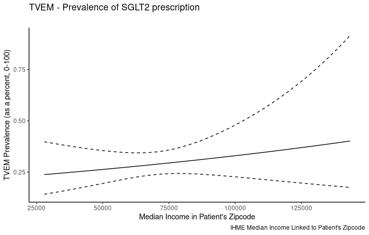
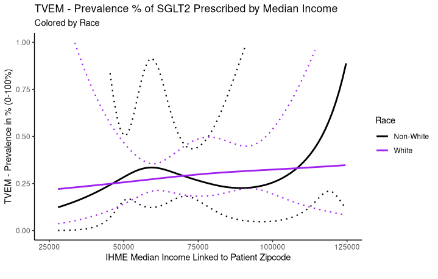
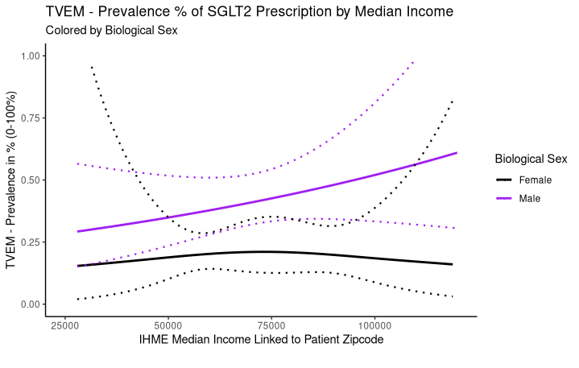

```{r setup, include=FALSE}
knitr::opts_chunk$set(echo = FALSE,
                      error = TRUE,
                      message = FALSE,
                      warning = FALSE)

# save for later
# nocite: '@*'

# load R packages
library(tidyverse)
#library(arsenal)
library(knitcitations)

# set up citations
cleanbib()
options("citation_format" = "pandoc")
```

```{r}
# load data
# load("df_mainVars_hfpef_unircrd.pt1.2019.RData")
```

## Importance of Time-Varying Effect Models (TVEM) 

### TVEM Introduction

In traditional regression-based models, the model coefficients are treated as fixed or constant, e.g. there is only one intercept and one slope. 

Traditional Linear Model with Moderation Effect:

* $Y_i$ = outcome variable
* $\beta_0$ = intercept-term
* $\beta_1$ = coefficient for X
* $\epsilon_i$ = error term

$$Y_i = \beta_0 + \beta_1X + \epsilon_i$$

But let's suppose that the association between the predictors (X) and outcome (Y) are not fixed but vary in a non-linear way over the range of another variable. Suppose this other variable is time or age, but could be any other variable with a range of values that could affect the association between X and Y. For now, let's call this third variable $t$.

TVEM Linear Model:

* $Y_i$ = outcome variable
* $\beta_0(t)$ = intercept-term
* $\beta_1$(t) = coefficient for X, primary predictor
* $\epsilon_i$ = error term

$$Y_i = \beta_0(t) + \beta_1(t)X + \epsilon_i$$

So, now the model allows for there to be a series of intercept terms that vary over this 3rd variable $t$ and there are also a series of slope terms allowing the association between X and Y to vary over the range of $t$.

### Novel Research Questions with TVEM

TVEM extends the linear model to enable asking research questions that are not addressed by traditional linear models (including linear and logistic regression). TVEM enables research questions such as:

1. How does the prevalence of SGLT2 treatment prescription vary over median income linked to patient zip-code?
2. How does the association between clinical risk factors (such as BMI) and 28-day mortality vary based on environmental exposure to ozone levels? Do these varying associations significantly differ by biological sex?
3. How does the association between co-morbidities and risk of death during hospitalization or discharge to hospice vary based on neighborhood level access to healthcare (hospital beds per capita)? Do these varying associations significantly differ by race?

## Objectives and Aims

### Population of Interest and Rationale

The focus of our study is heart failure patients with preserved ejection fraction (HFpEF), defined as left-ventricular ejection fraction (LVEF) $\geq$ 50 percent. HFpEF has become a rapidly growing public health concern. HFpEF now comprises roughly half of all heart failure hospitalizations in the U.S. and its prevalence is steadily increasing worldwide`r citep("10.1161/CIR.0000000000001063")`, `r citep("10.15420/cfr.2023.05")`. Unlike heart failure with reduced ejection fraction (HFrEF), which has benefited from numerous therapies, HFpEF remains under-studied and under-treated. 

While pharmacologic therapies for HFpEF have historically lacked strong evidence of benefit, recent guidelines now provide Class 2a and 2b recommendations for several agents, including SGLT2 inhibitors (Class 2a) and ARNi, MRA, ARB, and diuretics (Class 2b or Class 1 for symptom relief), though the overall level of evidence remains lower than that for HFrEF, underscoring persistent gaps in robust, high-quality data to guide treatment in this population `r citep("10.1161/CIR.0000000000001063")`, `r citep("10.1161/circresaha.116.310119")`, `r citep("10.1016/j.jacc.2023.01.049")`. This gap is especially urgent to address as the epidemiology of HFpEF is changing. Incidence is rising not only in older adults but also in younger patients, with recent data showing HF-related mortality increasing among adults under 45, particularly among Black Americans `r citep("10.1001/jamacardio.2022.2213")`, `r citep("10.1161/CIRCULATIONAHA.118.034720")`.

Meanwhile, the overall burden to health systems is enormous as HFpEF patients experience frequent hospitalizations and high resource use, driving up costs for Medicare and Medicaid. U.S. heart failure costs are projected to exceed $50 billion by 2030 [@Lam2021], and emerging data suggest HFpEF carries a cost burden comparable to HFrEF `r citep("10.1016/j.jchf.2017.12.007")`. In short, HFpEF’s rising incidence, evolving risk in younger populations, heavy Medicare/Medicaid costs, and lack of well-defined therapies (relative to HFrEF) underscore an urgent need for focused research.

Equally compelling is the evidence of outcome disparities in HFpEF across sociodemographic lines. HFpEF disproportionately affects older women and racial minority populations `r citep("10.1007/s12170-024-00755-4")`, yet these groups often experience worse outcomes and variable care. For example, Black patients develop HFpEF at younger ages and with different comorbidity profiles than white patients `r citep("10.1161/jaha.116.003330")`, [@Brown2024], and minoritized groups face higher acute care utilization and costs after HFpEF hospitalization `r citep("10.1016/j.jchf.2017.12.007")`. Notably, treatment patterns also differ; guideline-directed therapies (when available) are under-utilized in women and racial/ethnic minorities `r citep("10.1007/s12170-024-00755-4")`. 

A striking case is the new class of sodium–glucose cotransporter-2 (SGLT2) inhibitors, proven to improve HFpEF outcomes, which are effective but under-prescribed in Black and Hispanic patients `r citep("10.1007/s12170-024-00755-4")`. These disparities hint that SDOH strongly influence HFpEF risks and outcomes. Indeed, structural and social factors (poverty, racial residential segregation, education, etc.) can shape the burden of cardiovascular risk factors leading to HFpEF `r citep("10.1007/s12170-024-00755-4")`. For instance, structural racism has constrained the built environment for many communities of color, limiting access to safe exercise spaces and healthy foods; such conditions promote hypertension, obesity and other HFpEF precursors `r citep("10.1007/s12170-024-00755-4")`. Similarly, environmental exposures like air pollution and extreme heat disproportionately impact low-income neighborhoods `r citep("doi.org/10.1016/j.joclim.2025.100414")`, potentially exacerbating heart failure hospitalizations. These patterns suggest that SDOH are key modifiers in the pathway from traditional risk factors (age, sex, race, diabetes, etc.) to clinical outcomes in HFpEF. Understanding how SDOH domains modify HFpEF outcomes is the core rationale for this proposal. 

### Research Aims

We propose to investigate how social determinants of health (SDOH) modify the relationship between key predisposing factors and clinical outcomes in patients hospitalized with heart failure with preserved ejection fraction (HFpEF). 

Each aim will incorporate five key SDOH domains [1] Environmental Exposures, [2] Healthcare Access, [3] Community Health Risk, [4] Built Environment/Stress, and [5] Structural Risk Factors, as effect modifiers using time-varying effects models (TVEM).

* Specific Aim 1: To determine to what extent SDOH modify and over what SDOH levels the association between predisposing factors and clinical risk burden, as measured by the modified EFFECT risk score for both 28-day and 1-year mortality, is strongest in patients hospitalized with HFpEF. 

* Specific Aim 2: To assess to what extent SDOH modify and over what SDOH levels the association between predisposing factors and discharge outcomes (death or hospice versus other dispositions) are highest following HFpEF hospitalization. 

* Specific Aim 3: To evaluate to what extent SDOH modify and over what SDOH levels the association between predisposing factors and the likelihood of receiving an SGLT2 inhibitor prescription at discharge is highest among HFpEF patients. 

## Analysis Plan

### GWTG HF Database

The Get With The Guidelines - Heart Failure (GWTG-HF) database is compiled as part of the American Heart Association’s collaborative quality improvement program for patients hospitalized with heart failure. The database includes over 2 million records for admissions of patients with heart failure from 2005 - 2022.

### Records Selection

As part of the initial data cleaning and selection process, all duplicate records will be removed and only unique patients will be retained for analysis. 

* STEP 1: Read in GWTG-HF Full Dataset with Linked SDOH measures

```
# download GWTG-HF Full Database with linked SDOH variables
df_mainVars = read_data(
  database_name='gwtg-hf-sdoh-db',
  table_name='v1_2024-06_gwtg_hf_sdoh_linked',
  )
```

* STEP 2: Select HFpEF - Given that our focus is on HFpEF, we first filter out these patients

```
# keep only those wth preserved EF
df_mainVars_hfpef <- df_mainVars %>%
  filter(lvef == 3)
```

* STEP 3: Remove duplicate records - while minimized, some records were duplicated and these need to be removed first

```
# convert admission dates to date format
df_mainVars_hfpef$admdti.date <-
  as.Date(df_mainVars_hfpef$admdti,
          format = "%Y-%m-%d %H:%M:%S")

# keep unique rcrdnum
df_mainVars_hfpef_unircrd <- df_mainVars_hfpef %>% 
  group_by(rcrdnum) %>% 
  arrange(admdti.date) %>% 
  slice(1) %>% 
  ungroup()
```

* STEP 4: For our initial analyses, we will focus on the first recorded admissions for each patient. Unique patients are identified using `patient_display_id` and `facility_display_id` fields in the database. _If we have time at the end of the funding period, we may explore readmission models for patients with more than one recorded admission in the database._

```
# merge patient IDs and facility IDs
df_mainVars_hfpef_unircrd$ptfacid <- 
  paste(df_mainVars_hfpef_unircrd$patient_display_id,
        df_mainVars_hfpef_unircrd$facility_display_id)

# get unique patients at 1st admit date
df_mainVars_hfpef_unircrd.pt1 <- df_mainVars_hfpef_unircrd %>% 
  group_by(patient_display_id, 
           facility_display_id) %>% 
  arrange(admdti.date) %>% 
  slice(1) %>% 
  ungroup()
```

Given this workflow, the final set of records for our planned analyses is 848,738 patients, see Figure 1 below.



### Variables to be included:

#### **Outcome Variables for Models**

The following variables will be included for computing the outcomes to be modeled in our analyses:

* OUTCOME 1: Discharge Status - either death or discharged to hospice [`dschstati`]
```
df_mainVars_hfpef_unircrd.pt1$dschstati.DH <- ifelse(
  (as.numeric(df_mainVars_hfpef_unircrd.pt1$dschstati) == 2) |
    (as.numeric(df_mainVars_hfpef_unircrd.pt1$dschstati) == 3) |
    (as.numeric(df_mainVars_hfpef_unircrd.pt1$dschstati) == 6),
  1, 0
)
```
* OUTCOME 2: Prescribed SGLT2 [`sglt2i_disc`]
```
# get numbers
df_mainVars_hfpef_unircrd.pt1.2019$sglt2i_disc.num <-
  as.numeric(df_mainVars_hfpef_unircrd.pt1.2019$sglt2i_disc)
  
# select 1=yes, 2=not prescribes, 3=contraindicated
df_mainVars_hfpef_unircrd.pt1.2019 <-
  df_mainVars_hfpef_unircrd.pt1.2019 %>%
  mutate(sglt2i_disc.yes = case_when(
    sglt2i_disc.num == 1 ~ 1,
    sglt2i_disc.num == 2 ~ 0,
    sglt2i_disc.num == 3 ~ 0,
    is.na(sglt2i_disc.num) ~ 0,
  ))
```
* OUTCOME 3: modified-EFFECT score from ARIC Trial will include these variables to compute 28-day mortality and 1-year mortality risk `r citep("10.1161/CIRCHEARTFAILURE.117.003992")`
    - `agei` (age in years)
    - `sbpi` (systolic blood pressure in mmHg)
    - `buni` (BUN in mg/dL)
    - `sodiumi` (Sodium in mEq/L)
    - `medhist_11` (CVA/TIA)
    - `medhist_03` (COPD)
    - `hgb_admit` (hemoglobin in g/dL)
    - `hri` (heart rate in beats per minute, bpm)
    - `bnpi` or `nbnpi` (Brain or B-type Natriuretic Peptide in or N-terminal pro-B-type natriuretic peptide in pg/mL)
    - hypoxia - this variable was not captured in the GWTG-HF database, but we will used these variables to compile an assessment of low-oxygen risk:
        - `medhist_30` (sleep disordered breathing)
        - `hfprocedures_131` (ecmo used)
        - `hfprocedures_119` (mechanical vent used during hospitalization)
    - `racei` (compare White to non-White)
    - `bmii` (body mass index in kg/m2)

#### **Variables for Model Predictors**

The following variables will be used as key patient-level risk factors in our models:

* Patient Demographics:
    - `agei` (age in year)
    - `genderi` (gender)
    - `racei` and `race2i` (race-ethnicity)
    - `insurancei` (health insurance status)
    
* Clinical Risk Factors:
    - `ischemici` (Ischemic Etiology - medical history of CAD, prior MI, prior PCI, or prior CABG)
    - `dmhx` and `dmhxdg` (history of diabetes or new diagnosis)
    - `bmii` (body mass index)
    - `hfhospadm` (number of hospital admission in last 12 months)
    - `admitsource` (point of origin for admission)
    - `hxsmoking` and `hxvap` (history of smoking or vaping)
    - [or admissions during or post-COVID] we will also consider:
        - `medhist_38` (history of SARS-COV-1)
        - `medhist_39` (history of SARS-COV-2, COVID-19)
        - `activeinfec_05` (active infection of SARS-COV-1)
        - `activeinfec_06` (active infection of SARS-COV-2, COVID-19)

#### **Variable for Varying SDOH Moderators**

For the TVEM models, we will consider the social determinants of health (SDOH) which are already linked at the patient-level by patient address zip-codes within the GWTG-HF full database. These variables cover the following SDOH domains:

* Environmental Exposures
    - Institute for Health Metrics and Evaluation (IHME) data including environmental pollution measures of ozone, nitrous dioxide, PM2.5 particulates
    - EPA AQS (Environmental Protection Agency - Air Quality System) for data linked by year and patient-level zip code for ozone, PM2.5 particulates, and days with excessive heat
* Healthcare Access
    - ACS (American Community Survey) measures of hospital bed per capita assessed at the county-level linked by patient zip code and percentage of homes with no Internet access
* Community Health Risk
    - Data from the CDC (Centers of Disease Control and Prevention)'s [PLACES database](https://www.cdc.gov/places/) which provides  ()[https://www.cdc.gov/places/] from health-related data for all U.S. counties, incorporated and census designated places, census tracts, and ZIP Code Tabulation Areas (ZCTAs). These measures include per capita percentage for: teeth lost among adults aged 65 years or older (per capita), adults aged 18 years or older reporting no leisure-time physical activity, asthma prevalence, and rates of depression.
* Built Environmental Exposures
    - [NANDA (National Neighborhood Data Archive)](https://nanda.isr.umich.edu/data/) which was "created to facilitate research on the relationship between neighborhoods and health". These variables include: number of parks and daily traffic counts.
* Structural Risk Factors
    - IHME data including county-specific measures (like median income) as well as race/ethnicity specific measures (like life expectancy and levels of home ownership) and race + age + sex specific measures (like mortality all cause and years of life lost)

## Preliminary Findings - Example Analyses

The following code and figures demonstrate the kind of models and findings that will be possible from TVEM models for evaluating to what extent and over what levels of SDOH measures change the associations between patient demographic and clinical risk variables and the outcomes for mortality and morbidity and recommended treatment guidelines.

_NOTE: For these examples shown here, we only used data from one year, 2019 to illustrate the proof of concept. Upon receipt of an award, the fully-funded study will consider all data from 2005-2022. To fully model all years much longer computation times will be needed._

### Example Model 1: Prevalence of death or discharge by patient level demographics varying by median neighborhood income levels

The following TVEM models estimate the prevalence of death or discharge to hospice (DeathHospice) over median income levels (linked to patient's zipcode):

* overall
* by gender and 
* by race

These TVEM models estimate the Odds Ratios for death or discharged to hospice over the range of neightborhood level median income linked to patient zipcode.

#### Model 1a: Intercept only TVEM model for prevalence of death or discharge varying by median neighborhood income levels

Fit an intercept-only model for:

* $Y_i$ = outcome dv = `dschstati.DH` (dichotomous yes/no)
* $\beta_0(t)$ = SDOH-varying intercept term
  - this "intercept" provides an instantaneous estimate for the odds ratios for `dschstati.DH` yes vs No at each `ihme_zipincmednum` income level.
* $(t)$ = `ihme_zipincmednum`
* $\epsilon_i$ = error term

Log odds equation (i.e., the logit):

$$ln\left(\frac{P(DeathHospice)}{1-P(DeathHospice)}\right) = \beta_0(t) + \epsilon_i$$

Odds Equation - note exp for betas $\beta$:

$$\left(\frac{P(DeathHospice)}{1-P(DeathHospice)}\right) = e^{(\beta_0(t) + \epsilon_i)}$$

Prevalence = P(DeathHospice) = probability of death or discharged to hospice

$$P(DeathHospice) = \frac{e^{\beta_0(t)}}{1 + e^{\beta_0(t)}}$$

```
# fit intercept-only TVEM
model_tvem <-
  tvem(data = df_mainVars_hfpef_unircrd.pt1.2019,
       formula = dschstati.DH ~ 1,
       family = binomial(),
       id = rcrdnum.num,
       time = ihme_zipincmednum
       )
```

This TVEM model estimates show that in general the prevalence of death or discharge to hospice range from approximately 2% to around 6-7%, but the prevalences do vary but reach local maxima around $65K-$70K median income with a slight reduction for higher incomes of $90K-$100K but then rising again around $115K-$120K which illustrates that the effect of the SDOH of median income is not constant.



#### Model 1b: Prevalence of death or discharge associated with patient race varying by median neighborhood income levels

Fit an intercept + slope term (for 1 predictor) model for:

* $Y_i$ = outcome dv = `dschstati.DH` (dichotomous yes/no)
* $\beta_0(t)$ = SDOH-varying INTERCEPT term 
  - `racei.wnw` is coded 0=nonWhite, 1=White, the INTERCEPT term estimates the prevalence of death or discharge to hospice over neighborhood level median incomes for the reference "nonWhite" race
* $\beta_1(t)$ = SDOH-varying SLOPE term 
  - `racei.wnw` is coded 0=nonWhite, 1=White, the SLOPE term estimates the average DIFFERENCE in prevalence of death or discharge to hospice between "nonWhite" and "White" racial groups 
* $(t)$ = `ihme_zipincmednum`
* $X_i$ = predictor = `racei.wnw` (nonWhite vs White race)
* $\epsilon_i$ = error term 

Log odds equation (i.e., the logit):

$$ln\left(\frac{P(DeathHospice)}{1-P(DeathHospice)}\right)  = \beta_0(t) + \beta_1(t)X_i + \epsilon_i$$

Prevalence from log odds

As noted above we can convert the odds ratios to prevalence as:

$$P(DeathHospice) = \frac{e^{\beta_0(t) + \beta_1(t)X_i}}{1 + e^{\beta_0(t) + \beta_1(t)X_i}}$$

```
model_tvem <-
  tvem(data = dat1,
       formula = dschstati.DH ~ racei.wnw,
       family = binomial(),
       id = rcrdnum.num,
       time = ihme_zipincmednum
  )
```

This TVEM model estimates show that the prevalence of death or discharge to hospice is consistently higher for White race compared to non-White race and this difference is significantly different (confidence intervals do not overlap) for median income levels between approximately $35K and $120K with the difference the greatest at an income level of $65K-$70K. The confidence intervals are wider for the income levels with smaller sample sizes at both very low and very high median incomes.

 

#### Model 1c: Prevalence of death or discharge associated with patient gender varying by median neighborhood income levels

```
model_tvem <-
  tvem(data = dat1,
       formula = dschstati.DH ~ genderi.num,
       family = binomial(),
       id = rcrdnum.num,
       time = ihme_zipincmednum
  )
```

Similar to above, this TVEM model estimates show that the prevalence of death or discharge to hospice is consistently higher for Females compared to Males with no statistically significant differences over the median income levels (confidence intervals overlap). But there are some slight local maxima seen at median income levels of $65K-$70K and again at $120K.

 

### Example Model 2: Prevalence of recommended SGLT2 prescription by patient level demographics varying by median neighborhood income levels

These TVEM models follow the same approaches as we used above for modeling a dichotomous outcome.

#### Model 2a: Intercept only TVEM model for prevalence SGLT2 prescription varying by median neighborhood income levels

As can be seen the prevalence of SGLT2 prescription is very low (< 0.5%). While the levels are low, the prevalence does increase steadily from low to higher median income levels.

 

#### Model 2b: Intercept only TVEM model for prevalence SGLT2 prescription associated with patient race varying by median neighborhood income levels

Similar to the overall prevalence shown above, the prevalence of SGLT2 prescription is very low (< 0.5%) but does increase steadily from low to higher median income levels for patients of White race. For the nonWhite patients, the prevalence estimates vary quite a bit with wide confidence intervals due to the small sample sizes for this quick exampe using only 1 year of data. The planned final model will include all years of data which will provide for more stable estimates for the nonWhite patients.

 

#### Model 2c: Intercept only TVEM model for prevalence SGLT2 prescription associated with patient gender varying by median neighborhood income levels

Similar to the overall prevalence shown above, the prevalence of SGLT2 prescription is very low (< 0.5%) but does show that male patients are more likely to get SGLT2 prescriptions compared to female patients - and these difference increase steadily from low to higher median income levels. Interestingly, female patients living in higher income areas have some of the lowest SGLT2 prescription rates.

 


## R Packages Used

For this study the following R Packages will be used:

* `ggplot2` [@R-ggplot2]
* `dplyr` [@R-dplyr]
* `tvem` [@R-tvem]

```{r}
write.bibtex(file="references.bib")
knitr::write_bib(c(.packages(), "tvem"), "packages.bib")
```

## References


